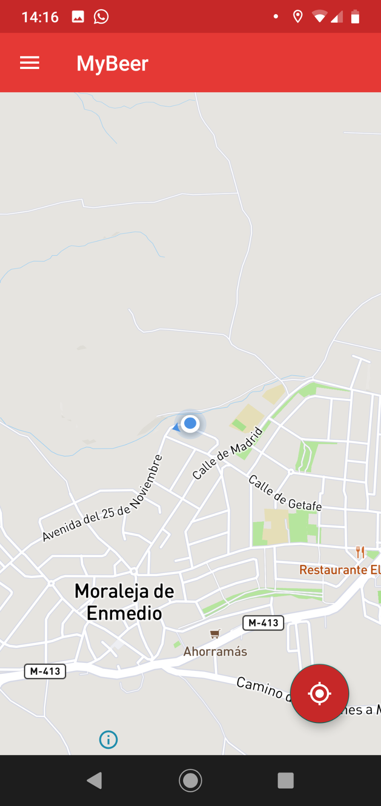
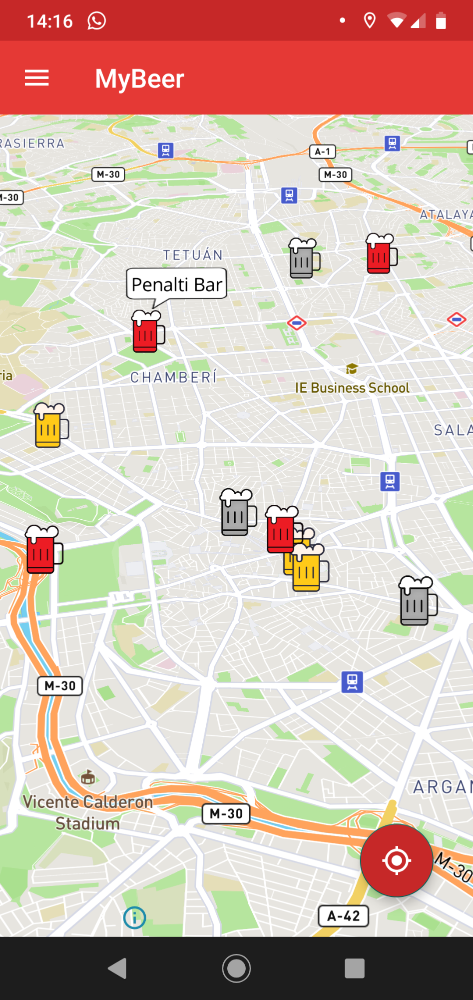
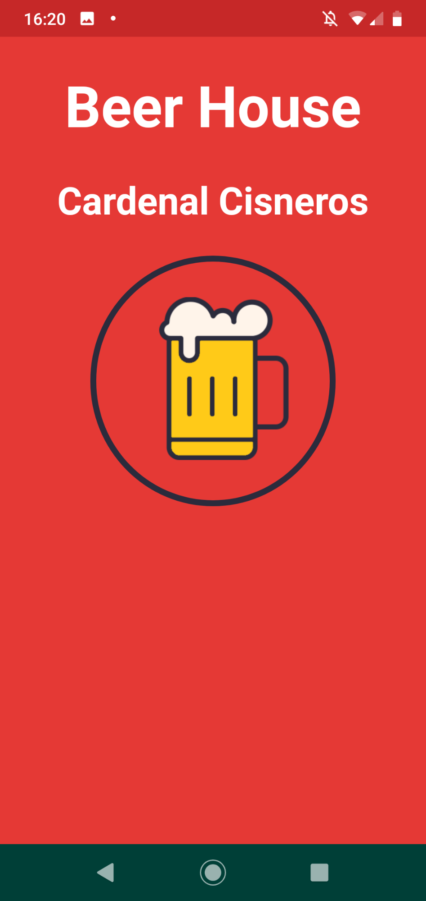
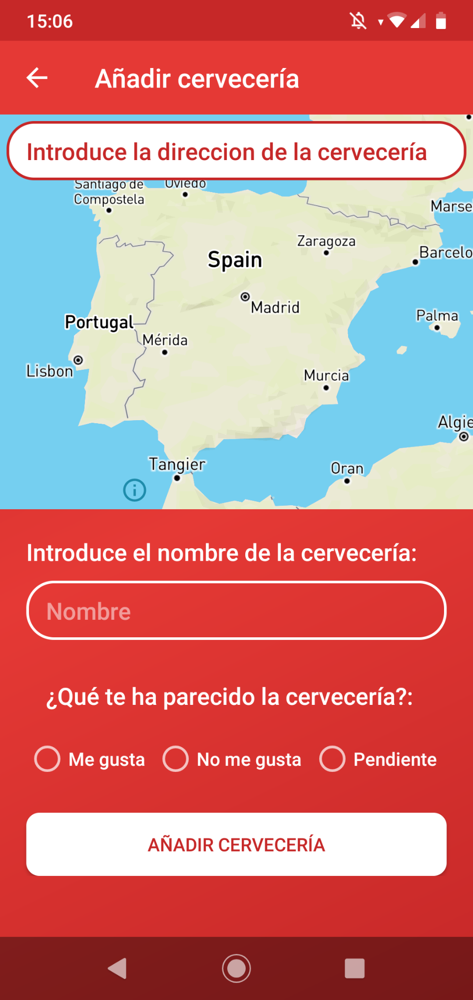
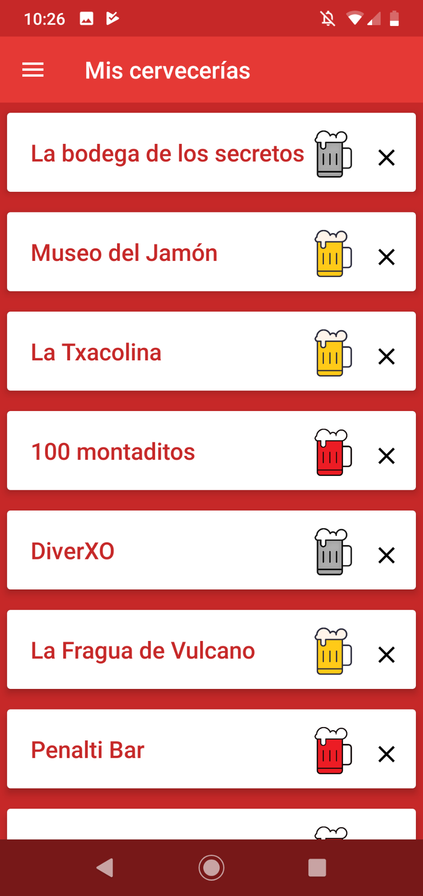
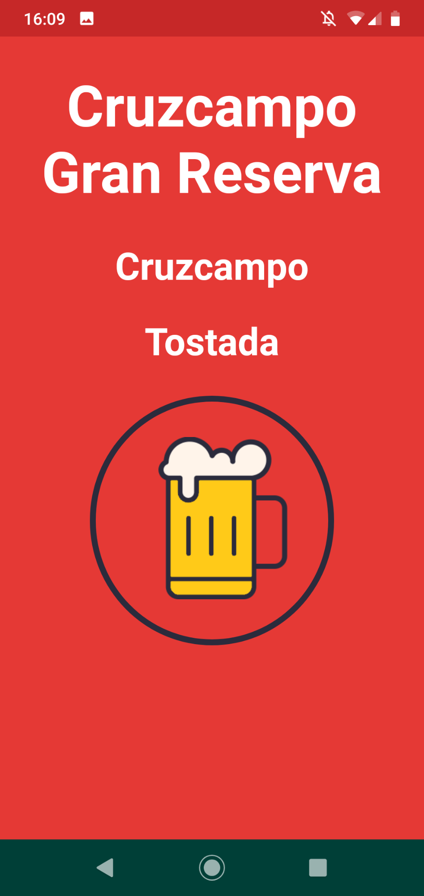
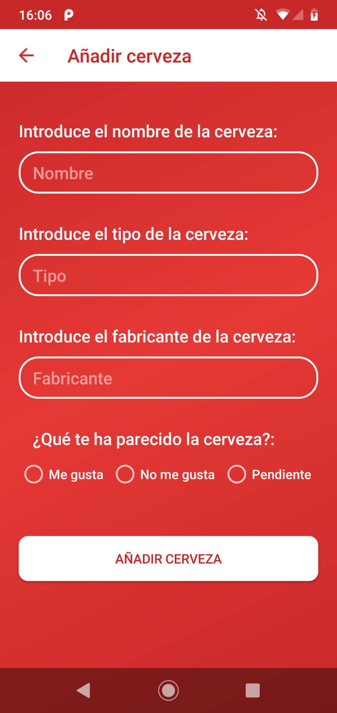
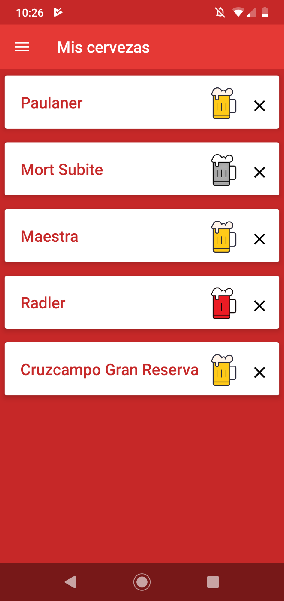

<html><head><meta content="text/html; charset=UTF-8" http-equiv="content-type"></head><body class="c37">

Programaci&oacute;n de Aplicaciones para Dispositivos M&oacute;viles

MEMORIA DE PROYECTO

Autores: Carlos Castellanos y V&iacute;ctor Chamizo

&Iacute;NDICE

<ol class="c12 lst-kix_5wp9fb8grn7c-0 start" start="1"><li class="c27 c10">Introducci&oacute;n &hellip;&hellip;&hellip;&hellip;&hellip;&hellip;&hellip;&hellip;&hellip;&hellip;&hellip;&hellip;&hellip;&hellip;&hellip;&hellip;&hellip;&hellip;&hellip;&hellip;&hellip;&hellip;&hellip;&hellip;&hellip;&hellip;&hellip;&hellip;&hellip;....... 2</li><li class="c27 c10">Manual de instalaci&oacute;n &hellip;&hellip;&hellip;&hellip;&hellip;&hellip;&hellip;&hellip;&hellip;&hellip;&hellip;&hellip;&hellip;&hellip;&hellip;&hellip;&hellip;&hellip;&hellip;&hellip;&hellip;&hellip;&hellip;&hellip;&hellip;&hellip;... 2</li></ol><ol class="c12 lst-kix_5wp9fb8grn7c-1 start" start="1"><li class="c9">Introducci&oacute;n &hellip;&hellip;&hellip;&hellip;&hellip;&hellip;&hellip;&hellip;&hellip;&hellip;&hellip;&hellip;&hellip;&hellip;&hellip;&hellip;&hellip;&hellip;&hellip;&hellip;&hellip;&hellip;&hellip;&hellip;&hellip;&hellip;.. 2</li><li class="c9">Requisitos &hellip;&hellip;&hellip;&hellip;&hellip;&hellip;&hellip;&hellip;&hellip;&hellip;&hellip;&hellip;&hellip;&hellip;&hellip;&hellip;&hellip;&hellip;&hellip;&hellip;&hellip;&hellip;&hellip;&hellip;&hellip;&hellip;&hellip;. 2</li><li class="c9">Instalaci&oacute;n del APK &hellip;&hellip;&hellip;&hellip;&hellip;&hellip;&hellip;&hellip;&hellip;&hellip;&hellip;&hellip;&hellip;&hellip;&hellip;&hellip;&hellip;&hellip;&hellip;&hellip;&hellip;&hellip;&hellip;. 3</li><li class="c9">Configuraci&oacute;n de proyecto en Android Studio &hellip;&hellip;&hellip;&hellip;&hellip;&hellip;&hellip;&hellip;&hellip;&hellip;.&hellip;... 3 </li></ol><ol class="c12 lst-kix_5wp9fb8grn7c-0" start="3"><li class="c10 c27">Manual de usuario &hellip;&hellip;&hellip;&hellip;&hellip;&hellip;&hellip;&hellip;&hellip;&hellip;&hellip;&hellip;&hellip;&hellip;&hellip;&hellip;&hellip;&hellip;&hellip;&hellip;&hellip;&hellip;&hellip;&hellip;&hellip;&hellip;&hellip;&hellip;. 3</li></ol><ol class="c12 lst-kix_5wp9fb8grn7c-1 start" start="1"><li class="c9">Introducci&oacute;n &hellip;&hellip;&hellip;&hellip;&hellip;&hellip;&hellip;&hellip;&hellip;&hellip;&hellip;&hellip;&hellip;&hellip;&hellip;&hellip;&hellip;&hellip;&hellip;&hellip;&hellip;&hellip;&hellip;&hellip;&hellip;&hellip;.. 3</li><li class="c9">Funcionalidad &hellip;&hellip;&hellip;&hellip;&hellip;&hellip;&hellip;&hellip;&hellip;&hellip;&hellip;&hellip;&hellip;&hellip;&hellip;&hellip;&hellip;&hellip;&hellip;&hellip;&hellip;&hellip;&hellip;&hellip;&hellip;... 4</li><li class="c9">M&oacute;dulos &hellip;&hellip;&hellip;&hellip;&hellip;&hellip;&hellip;&hellip;&hellip;&hellip;&hellip;&hellip;&hellip;&hellip;&hellip;&hellip;&hellip;&hellip;&hellip;&hellip;&hellip;&hellip;&hellip;&hellip;&hellip;&hellip;&hellip;&hellip;. 4</li></ol><ol class="c12 lst-kix_5wp9fb8grn7c-2 start" start="1"><li class="c24">Principal &hellip;&hellip;&hellip;&hellip;&hellip;&hellip;&hellip;&hellip;&hellip;&hellip;&hellip;&hellip;&hellip;&hellip;&hellip;&hellip;&hellip;&hellip;&hellip;&hellip;&hellip;&hellip;&hellip;&hellip;........ 4</li><li class="c24">Cervecer&iacute;as &hellip;&hellip;&hellip;&hellip;&hellip;&hellip;&hellip;&hellip;&hellip;&hellip;&hellip;&hellip;&hellip;&hellip;&hellip;&hellip;&hellip;&hellip;&hellip;&hellip;&hellip;&hellip;&hellip;&hellip;.. 5</li><li class="c24">Cervezas &hellip;&hellip;&hellip;&hellip;&hellip;&hellip;&hellip;&hellip;&hellip;&hellip;&hellip;&hellip;&hellip;&hellip;&hellip;&hellip;&hellip;&hellip;&hellip;&hellip;&hellip;&hellip;&hellip;...&hellip;... 6</li></ol><ol class="c12 lst-kix_5wp9fb8grn7c-0" start="4"><li class="c27 c10">Arquitectura &hellip;&hellip;&hellip;&hellip;&hellip;&hellip;&hellip;&hellip;&hellip;&hellip;&hellip;&hellip;&hellip;&hellip;&hellip;&hellip;&hellip;&hellip;&hellip;&hellip;&hellip;&hellip;&hellip;&hellip;&hellip;.&hellip;&hellip;..&hellip;&hellip;&hellip;. 7</li></ol><ol class="c12 lst-kix_5wp9fb8grn7c-1 start" start="1"><li class="c9">Introducci&oacute;n &hellip;&hellip;&hellip;&hellip;&hellip;&hellip;&hellip;&hellip;&hellip;&hellip;&hellip;&hellip;&hellip;&hellip;&hellip;&hellip;&hellip;&hellip;&hellip;&hellip;&hellip;&hellip;&hellip;&hellip;&hellip;&hellip;.. 7 </li><li class="c9">Dise&ntilde;o &hellip;&hellip;&hellip;&hellip;&hellip;&hellip;&hellip;&hellip;&hellip;&hellip;&hellip;&hellip;&hellip;&hellip;&hellip;&hellip;&hellip;&hellip;&hellip;&hellip;&hellip;&hellip;&hellip;&hellip;&hellip;&hellip;&hellip;&hellip;... 7</li></ol><ol class="c12 lst-kix_5wp9fb8grn7c-0" start="5"><li class="c27 c10">Consideraciones t&eacute;cnicas &hellip;&hellip;&hellip;&hellip;&hellip;&hellip;&hellip;&hellip;&hellip;&hellip;&hellip;&hellip;&hellip;&hellip;&hellip;&hellip;&hellip;&hellip;&hellip;&hellip;&hellip;&hellip;&hellip;&hellip;&hellip; 8</li></ol><ol class="c12 lst-kix_5wp9fb8grn7c-1 start" start="1"><li class="c9">Introducci&oacute;n &hellip;&hellip;&hellip;&hellip;&hellip;&hellip;&hellip;&hellip;&hellip;&hellip;&hellip;&hellip;&hellip;&hellip;&hellip;&hellip;&hellip;&hellip;&hellip;&hellip;&hellip;&hellip;&hellip;&hellip;&hellip;&hellip;.. 8</li><li class="c9">General &hellip;&hellip;&hellip;&hellip;&hellip;&hellip;&hellip;&hellip;&hellip;&hellip;&hellip;&hellip;&hellip;&hellip;&hellip;&hellip;&hellip;&hellip;&hellip;&hellip;&hellip;&hellip;&hellip;&hellip;&hellip;&hellip;&hellip;&hellip;.. 8</li><li class="c9">M&oacute;dulos &hellip;&hellip;&hellip;&hellip;&hellip;&hellip;&hellip;&hellip;&hellip;&hellip;&hellip;&hellip;&hellip;&hellip;&hellip;&hellip;&hellip;&hellip;&hellip;&hellip;&hellip;&hellip;&hellip;&hellip;&hellip;&hellip;&hellip;&hellip;. 9</li></ol><ol class="c12 lst-kix_5wp9fb8grn7c-2 start" start="1"><li class="c24">Principal &hellip;&hellip;&hellip;&hellip;&hellip;&hellip;&hellip;&hellip;&hellip;&hellip;&hellip;&hellip;&hellip;&hellip;&hellip;&hellip;&hellip;&hellip;&hellip;&hellip;&hellip;&hellip;&hellip;&hellip;........ 9</li><li class="c24">Cervecer&iacute;as y cervezas &hellip;&hellip;&hellip;&hellip;&hellip;&hellip;&hellip;&hellip;&hellip;&hellip;&hellip;&hellip;&hellip;&hellip;&hellip;&hellip;&hellip;&hellip;&hellip;.. 9</li></ol><ol class="c12 lst-kix_5wp9fb8grn7c-0" start="6"><li class="c27 c10">Desarrollo &hellip;&hellip;&hellip;&hellip;&hellip;&hellip;&hellip;&hellip;&hellip;&hellip;&hellip;&hellip;&hellip;&hellip;&hellip;&hellip;&hellip;&hellip;&hellip;&hellip;&hellip;&hellip;&hellip;&hellip;&hellip;&hellip;&hellip;&hellip;&hellip;&hellip;&hellip;&hellip; 9</li></ol><ol class="c12 lst-kix_5wp9fb8grn7c-1 start" start="1"><li class="c9">Introducci&oacute;n &hellip;&hellip;&hellip;&hellip;&hellip;&hellip;&hellip;&hellip;&hellip;&hellip;&hellip;&hellip;&hellip;&hellip;&hellip;&hellip;&hellip;&hellip;&hellip;&hellip;&hellip;&hellip;&hellip;&hellip;&hellip;&hellip;.. 9</li><li class="c9">Aportaciones &hellip;&hellip;&hellip;&hellip;&hellip;&hellip;&hellip;&hellip;&hellip;&hellip;&hellip;&hellip;&hellip;&hellip;&hellip;&hellip;&hellip;&hellip;&hellip;&hellip;&hellip;&hellip;&hellip;&hellip;&hellip;.. 10</li><li class="c9">Metodolog&iacute;a de trabajo &hellip;&hellip;&hellip;&hellip;&hellip;&hellip;&hellip;&hellip;&hellip;&hellip;&hellip;&hellip;&hellip;&hellip;&hellip;&hellip;&hellip;&hellip;&hellip;&hellip;&hellip;. 10</li><li class="c9">Conclusiones &hellip;&hellip;&hellip;&hellip;&hellip;&hellip;&hellip;&hellip;&hellip;&hellip;&hellip;&hellip;&hellip;&hellip;&hellip;&hellip;&hellip;&hellip;&hellip;&hellip;&hellip;&hellip;&hellip;&hellip;..&hellip; 10</li></ol><ol class="c12 lst-kix_5wp9fb8grn7c-0" start="7"><li class="c19 c10 c28">Bibliograf&iacute;a &hellip;&hellip;&hellip;&hellip;&hellip;&hellip;&hellip;&hellip;&hellip;&hellip;&hellip;&hellip;&hellip;&hellip;&hellip;&hellip;&hellip;&hellip;&hellip;&hellip;&hellip;&hellip;&hellip;&hellip;&hellip;&hellip;&hellip;&hellip;&hellip;&hellip;&hellip; 11</li></ol>

<ol class="c12 lst-kix_5pjpt7rdaq9n-0 start" start="1"><li class="c6"><h1 id="h.rkee8izd687d" style="display:inline">Introducci&oacute;n</h1></li></ol>
Este documento de memoria es realizado para el proyecto de la asignatura de Programaci&oacute;n de Aplicaciones para Dispositivos M&oacute;viles (PAD).

El documento proporciona las indicaciones y herramientas necesarias para el uso correcto de la aplicaci&oacute;n m&oacute;vil MyBeer. Adem&aacute;s, contiene un desglose detallado de la arquitectura interna y consideraciones t&eacute;cnicas llevadas a cabo en el desarrollo del proyecto, con la finalidad de poder acercar al usuario al entendimiento completo de la aplicaci&oacute;n, y as&iacute; mismo, ratificar la correcta implementaci&oacute;n de los requisitos impuestos por el profesor de la asignatura para llevar a cabo dicho proyecto.

La aplicaci&oacute;n fue dise&ntilde;ada para la gesti&oacute;n de cervecer&iacute;as y cervezas por parte del usuario, con la finalidad de poder localizar los establecimientos en un mapa y poder guardar la informaci&oacute;n de dichos elementos para que el usuario pueda acceder a ellos siempre que quiera.

<ol class="c12 lst-kix_5pjpt7rdaq9n-0" start="2"><li class="c6"><h1 id="h.6e08jr6w3epk" style="display:inline">Manual de instalaci&oacute;n</h1></li></ol><ol class="c12 lst-kix_5pjpt7rdaq9n-1 start" start="1"><li class="c3"><h2 id="h.glfoqq26u544" style="display:inline">Introducci&oacute;n</h2></li></ol>
Esta secci&oacute;n proporciona los detalles y requerimientos para la correcta instalaci&oacute;n de la aplicaci&oacute;n m&oacute;vil MyBeer, as&iacute; como una correcta configuraci&oacute;n de la misma en el SDK elegido para su desarrollo y despliegue.

<ol class="c12 lst-kix_5pjpt7rdaq9n-1" start="2"><li class="c3"><h2 id="h.glfoqq26u544-1" style="display:inline">Requisitos</h2></li></ol>
La aplicaci&oacute;n para este proyecto est&aacute; desarrollada de forma nativa para Android, por lo que el dispositivo del usuario ha de tener dicho sistema instalado. 

Adem&aacute;s, el sistema operativo debe tener como m&iacute;nimo la versi&oacute;n 23 de compilaci&oacute;n del SDK (Android 6.0, Marshmallow), aunque la versi&oacute;n de SDK que se ha utilizado para el desarrollo de la aplicaci&oacute;n es la 28 (Android 9.0, Pie).

La aplicaci&oacute;n precisa de localizaci&oacute;n mediante GPS por lo que ser&aacute; necesario tener activada esta opci&oacute;n en nuestro dispositivo m&oacute;vil, as&iacute; como acceso a la red de datos o a una red wifi. As&iacute; mismo, la primera vez que iniciemos la aplicaci&oacute;n, esta nos solicitar&aacute; permisos para poder acceder a dichos servicios GPS.
<ol class="c12 lst-kix_5pjpt7rdaq9n-1" start="3"><li class="c3"><h2 id="h.glfoqq26u544-2" style="display:inline">Instalaci&oacute;n del APK</h2></li></ol>
A continuaci&oacute;n se detallan los pasos a seguir para la correcta instalaci&oacute;n de la aplicaci&oacute;n en el dispositivo m&oacute;vil:

<ol class="c12 lst-kix_tdc5evwda2oh-0 start" start="1"><li class="c22">Descargar el archivo myBeerInstaller.apk&nbsp;en el m&oacute;vil.</li><li class="c22">Ejecutar el archivo myBeerInstaller.apk.</li><li class="c14 c28">Por motivos de seguridad, Android suele tener desactivado el permiso para instalar aplicaciones ajenas a Play Store (Aplicaciones de origen desconocido). En caso de tener esta opci&oacute;n habilitada, se puede pasar directamente al paso 4.</li></ol>

En caso contrario, se le pedir&aacute; que active este permiso y se le redirigir&aacute; a la ventana de ajustes donde aparece tal opci&oacute;n. Tambi&eacute;n se puede acceder directamente mediante los siguientes pasos:

Ajustes &gt; Ajustes avanzados &gt; Seguridad &gt; Aplicaciones de origen desconocido.

NOTA: La navegaci&oacute;n a trav&eacute;s de los ajustes puede variar ligeramente en funci&oacute;n de la versi&oacute;n de Android y de la capa de personalizaci&oacute;n del fabricante.Se recomienda volver a desactivar esta opci&oacute;n una vez instalada la aplicaci&oacute;n

<ol class="c12 lst-kix_tdc5evwda2oh-0" start="4"><li class="c14 c28">Volver a ejecutar el archivo myBeerInstaller.apk&nbsp;y finalizar la instalaci&oacute;n.</li></ol>

<ol class="c12 lst-kix_5pjpt7rdaq9n-1" start="4"><li class="c3"><h2 id="h.glfoqq26u544-3" style="display:inline">Configuraci&oacute;n de proyecto en Android Studio</h2></li></ol>
En primer lugar debemos abrir el proyecto en Android Studio (File &gt; Open...). A continuaci&oacute;n, debemos construir el proyecto para su correcto uso y para que todas las librer&iacute;as e importaciones de API&acute;s externas funcionen correctamente (Build &gt; Make Project).

Una vez que el proceso anteriormente descrito finalice, nuestro proyecto estar&aacute; listo para continuar con su desarrollo.

<ol class="c12 lst-kix_5pjpt7rdaq9n-0" start="3"><li class="c6"><h1 id="h.14vachcvs9q7" style="display:inline">Manual de usuario</h1></li></ol><ol class="c12 lst-kix_5pjpt7rdaq9n-1 start" start="1"><li class="c3"><h2 id="h.8z524odtvy2f" style="display:inline">Introducci&oacute;n</h2></li></ol>
Este manual proporciona los detalles y requerimientos para el uso de la aplicaci&oacute;n m&oacute;vil MyBeer. Los siguientes ep&iacute;grafes proporcionan los detalles y requerimientos necesarios &nbsp;para el uso correcto de la aplicaci&oacute;n m&oacute;vil, con la finalidad de brindar al usuario una herramienta que asegure un uso satisfactorio de la misma.

<ol class="c12 lst-kix_5pjpt7rdaq9n-1" start="2"><li class="c3"><h2 id="h.8z524odtvy2f-4" style="display:inline">Funcionalidad</h2></li></ol>
La funcionalidad principal de la aplicaci&oacute;n est&aacute; formada por tres m&oacute;dulos (Principal, Cervecer&iacute;as y Cervezas), que son accesibles a trav&eacute;s de un men&uacute; lateral. A dicho men&uacute; podr&aacute; accederse pulsando sobre el bot&oacute;n superior izquierdo de la interfaz o bien deslizando el dedo desde la parte izquierda de la pantalla hacia la parte derecha.

Los distintos m&oacute;dulos y sus funcionalidades ser&aacute; explicados en el siguiente ep&iacute;grafe (3.3 M&oacute;dulos).

<ol class="c12 lst-kix_5pjpt7rdaq9n-1" start="3"><li class="c28 c33"><h2 id="h.8z524odtvy2f-5" style="display:inline">M&oacute;dulos</h2></li></ol><ol class="c12 lst-kix_5pjpt7rdaq9n-2 start" start="1"><li class="c29 c28"><h3 id="h.ndd0fmj6317n" style="display:inline">Principal</h3></li></ol>
El m&oacute;dulo principal consiste en un mapa que nos mostrar&aacute; nuestra geolocalizaci&oacute;n, as&iacute; como las cervecer&iacute;as (en caso de tener alguna) situadas en sus respectivas localizaciones.

&nbsp; &nbsp; &nbsp; &nbsp; &nbsp; &nbsp; &nbsp; &nbsp; &nbsp; &nbsp; Figura 3.3.1.1 &nbsp; &nbsp; &nbsp; &nbsp; &nbsp; &nbsp; &nbsp; &nbsp; &nbsp; &nbsp; &nbsp; &nbsp; &nbsp; &nbsp; &nbsp; &nbsp; &nbsp; &nbsp; &nbsp; &nbsp; &nbsp;Figura 3.3.1.2

Las cervecer&iacute;as pueden mostrarse de diferentes colores seg&uacute;n su estado. En primer lugar, las cervecer&iacute;as que se encuentran en color amarillo son las que el usuario ha calificado como positivas (&ldquo;Me gusta&rdquo;), por otro lado aquellas que se encuentran de color rojo son aquellas calificadas de forma negativa (&ldquo;No me gusta&rdquo;), por &uacute;ltimo, podemos encontrarnos cervecer&iacute;as en color gris, lo que significa que el usuario la ha introducido como &ldquo;pendiente&rdquo;, es decir, a&uacute;n no las ha visitado (Figura 3.3.1.1).

Cabe destacar que al pulsar sobre una cervecer&iacute;a, aparecer&aacute; el nombre que el usuario eligi&oacute; para ella en el momento de a&ntilde;adirlas.

Y por &uacute;ltimo, en la parte inferior derecha podemos observar un bot&oacute;n flotante, el cual si pulsamos sobre &eacute;l, nos redirigir&aacute; de forma autom&aacute;tica a nuestra posici&oacute;n en el mapa (Figura 3.3.1.2).

<ol class="c12 lst-kix_5pjpt7rdaq9n-2" start="2"><li class="c28 c29"><h3 id="h.tp2b8ytbk4qw" style="display:inline">Cervecer&iacute;as</h3></li></ol>
El m&oacute;dulo &lsquo;cervecer&iacute;as&rsquo; tiene dos funcionalidades principales: a&ntilde;adir una nueva cervecer&iacute;a y listar las cervecer&iacute;as que el usuario ha guardado.

La primera funcionalidad consiste en un formulario en el que tendremos que introducir la direcci&oacute;n de la cervecer&iacute;a (una vez seleccionada podremos visualizarla en el mapa), el nombre que el usuario quiere darle a dicha cervecer&iacute;a y el estado; recordemos que estos estados son: &ldquo;Me gusta&rdquo;, &ldquo;No me gusta&rdquo; y &ldquo;Pendiente&rdquo;.

Una vez hayamos completado el formulario podremos a&ntilde;adir la cervecer&iacute;a pulsando sobre el bot&oacute;n situado en la parte inferior (Figura 3.3.2.1).

NOTA: todos los campos deben estar completados, de lo contrario nos aparecer&aacute; un mensaje de advertencia indic&aacute;ndonos el error y no podremos a&ntilde;adir la cervecer&iacute;a cuando pulsemos el bot&oacute;n.

La otra funcionalidad principal de este m&oacute;dulo consiste en una lista con las diferentes cervecer&iacute;as que el usuario ha ido a&ntilde;adiendo (Figura 3.3.2.2). En cada una de las cervecer&iacute;as listadas podemos apreciar que aparece indicado su nombre y el icono que refleja el estado de la cervecer&iacute;a, siguiendo el mismo patr&oacute;n que se ha comentado en el m&oacute;dulo anterior (3.3.1. Principal).

Adem&aacute;s se podr&aacute; eliminar una cervecer&iacute;a de la lista pulsando en la &lsquo;X&rsquo; que aparece a su derecha.

Por &uacute;ltimo, al pulsar sobre cada una de las cervecer&iacute;as listadas nos redirigir&aacute; a una vista donde podremos apreciar la informaci&oacute;n de la cervecer&iacute;a con m&aacute;s detalle (Figura 3.3.2.3).

&nbsp; &nbsp; &nbsp; &nbsp; &nbsp; &nbsp;Figura 3.3.2.1 &nbsp; &nbsp; &nbsp; &nbsp; &nbsp; &nbsp; &nbsp; &nbsp; &nbsp; &nbsp; &nbsp; &nbsp; &nbsp; &nbsp; &nbsp;Figura 3.3.2.2 &nbsp; &nbsp; &nbsp; &nbsp; &nbsp; &nbsp; &nbsp; &nbsp; &nbsp; &nbsp; &nbsp; &nbsp; &nbsp; &nbsp; Figura 3.3.2.3

<ol class="c12 lst-kix_5pjpt7rdaq9n-2" start="3"><li class="c29 c28"><h3 id="h.tp2b8ytbk4qw-6" style="display:inline">Cervezas</h3></li></ol>
El m&oacute;dulo &lsquo;cervezas&rsquo; al igual que el m&oacute;dulo cervecer&iacute;as est&aacute; constituido de dos funcionalidades principales: a&ntilde;adir una nueva cerveza y listas las cervezas guardadas por el usuario.

En la funcionalidad a&ntilde;adir tendremos un formulario muy similar al utilizado en a&ntilde;adir cervecer&iacute;a, en el que tendremos que completar todos los campos mostrados y proceder posteriormente a a&ntilde;adir una nueva cerveza (Figura 3.3.3.1). Al igual que en el m&oacute;dulo anterior, es necesario que todos los campos del formulario est&eacute;n completados para poder a&ntilde;adir la cerveza.

La funcionalidad &lsquo;listar&rsquo; consiste en mostrar, de forma id&eacute;ntica a &lsquo;listar cervecer&iacute;as&rsquo;, el conjunto de cervezas guardadas por el usuario (Figura 3.3.3.2). Podremos pulsar sobre cada una de las cervezas, lo que nos mostrar&aacute; una interfaz m&aacute;s detallada con la informaci&oacute;n de dicha cerveza (Figura 3.3.3.3).

Adem&aacute;s, aqu&iacute; tambi&eacute;n podremos eliminar una cerveza al igual que en el anterior m&oacute;dulo: pulsando sobre la &lsquo;X&rsquo; a la derecha en la lista.

&nbsp; &nbsp; &nbsp; &nbsp; &nbsp; Figura 3.3.3.1 &nbsp; &nbsp; &nbsp; &nbsp; &nbsp; &nbsp; &nbsp; &nbsp; &nbsp; &nbsp; &nbsp; &nbsp; &nbsp; &nbsp;Figura 3.3.3.2 &nbsp; &nbsp; &nbsp; &nbsp; &nbsp; &nbsp; &nbsp; &nbsp; &nbsp; &nbsp; &nbsp; &nbsp; &nbsp; &nbsp; &nbsp;Figura 3.3.3.3

<ol class="c12 lst-kix_5pjpt7rdaq9n-0" start="4"><li class="c6"><h1 id="h.5wgub34kx4n6" style="display:inline">Arquitectura</h1></li></ol><ol class="c12 lst-kix_5pjpt7rdaq9n-1 start" start="1"><li class="c3"><h2 id="h.7mzh6d5x2vno" style="display:inline">Introducci&oacute;n</h2></li></ol>
En el siguiente cap&iacute;tulo se detallar&aacute;n las diferentes capas de las que consta la aplicaci&oacute;n, as&iacute; como la organizaci&oacute;n interna de la misma, con el fin de que la aplicaci&oacute;n sea mantenible y f&aacute;cil de comprender para posibles desarrollos de mejora o ampliaci&oacute;n en el futuro.
<ol class="c12 lst-kix_5pjpt7rdaq9n-1" start="2"><li class="c3"><h2 id="h.7mzh6d5x2vno-7" style="display:inline">Dise&ntilde;o</h2></li></ol>
La aplicaci&oacute;n sigue una arquitectura multicapa; cada una de dichas capas sigue una finalidad de abstracci&oacute;n bien diferenciadas, aportando as&iacute; completa independencia unas de otras. A continuaci&oacute;n, detallaremos cada una de las capas:

<ul class="c12 lst-kix_adkridwdxyf0-0 start"><li class="c19 c10 c28">Capa de presentaci&oacute;n:&nbsp;representada por el paquete activities, es la encargada de renderizar las vistas para que el usuario obtenga el resultado esperado en todo momento. Esta capa, aunque no se encarga de la l&oacute;gica de la aplicaci&oacute;n, si realiza peque&ntilde;as validaciones que est&aacute;n estrechamente ligadas al formato de entrada (por ejemplo para evitar que los datos lleguen con campos vac&iacute;os), y as&iacute;, de esta forma, garantizar que la experiencia de usuario sea m&aacute;s satisfactoria.</li></ul>

<ul class="c12 lst-kix_adkridwdxyf0-0"><li class="c19 c10 c28">Capa de negocio: formada por los servicios de la aplicaci&oacute;n, se encuentra ubicada en el paquete model. En esta capa tiene lugar toda la l&oacute;gica de la aplicaci&oacute;n, encargada de que se cumplan las reglas de negocio necesarias para el correcto funcionamiento de la misma. Existe un servicio de aplicaci&oacute;n por cada m&oacute;dulo (Principal, Cervecer&iacute;a y Cerveza).</li></ul>

<ul class="c12 lst-kix_adkridwdxyf0-0"><li class="c19 c10 c28">&nbsp;Capa de integraci&oacute;n: capa encargada de comunicarse con el dispositivo m&oacute;vil para la lectura y escritura de los datos necesarios para que la aplicaci&oacute;n se desarrolle correctamente. Se encuentra en el paquete wrapper&nbsp;y est&aacute; formada por una &uacute;nica clase llamada FileManager que se encarga de implementar los m&eacute;todos de todos los m&oacute;dulos.</li></ul>

<ol class="c12 lst-kix_5pjpt7rdaq9n-0" start="5"><li class="c6"><h1 id="h.hdp4rrp351tp" style="display:inline">Consideraciones t&eacute;cnicas</h1></li></ol><ol class="c12 lst-kix_5pjpt7rdaq9n-1 start" start="1"><li class="c3"><h2 id="h.slgi84cef70u" style="display:inline">Introducci&oacute;n</h2></li></ol>
En el siguiente cap&iacute;tulo se detallar&aacute;n los aspectos t&eacute;cnicos llevados a cabo a lo largo del desarrollo de la aplicaci&oacute;n tratando as&iacute; de plasmar de forma clara y concisa que la declaraci&oacute;n de requisitos previos al desarrollo del proyecto han sido implementados satisfactoriamente.

<ol class="c12 lst-kix_5pjpt7rdaq9n-1" start="2"><li class="c28 c42"><h2 id="h.9fz9omnsnfh" style="display:inline">General</h2></li></ol>
Como parte generalizada de la implementaci&oacute;n de los requisitos podemos destacar la presencia en toda la aplicaci&oacute;n de los siguientes aspectos:

<ul class="c12 lst-kix_o2wv1e3z3v3m-0 start"><li class="c21 c10 c28">Visualizaci&oacute;n apropiada en diferentes configuraciones de pantalla: se ha cuidado el aspecto visual de la de aplicaci&oacute;n incidiendo especialmente en la visualizaci&oacute;n vertical de la misma, adem&aacute;s se ha probado en m&uacute;ltiples plataformas con diferentes configuraciones de pantalla con el fin de que la aplicaci&oacute;n tenga un uso &oacute;ptimo y satisfactorio en el mayor n&uacute;mero de dispositivos posibles.</li></ul>

<ul class="c12 lst-kix_o2wv1e3z3v3m-0"><li class="c21 c10 c28">Almacenamiento permanente de la informaci&oacute;n: toda el desarrollo relacionado con el almacenamiento de la informaci&oacute;n de la aplicaci&oacute;n (cervecer&iacute;as y cervezas) se ha concebido de forma que dicha informaci&oacute;n quede registrada de forma permanente en el dispositivo del usuario. De esta forma logramos que el intercambio de informaci&oacute;n sea m&aacute;s r&aacute;pido, mejorando as&iacute;, la experiencia del usuario.</li></ul>

<ol class="c12 lst-kix_5pjpt7rdaq9n-1" start="3"><li class="c33 c28"><h2 id="h.5kkp0uy5tdvf" style="display:inline">M&oacute;dulos</h2></li></ol><ol class="c12 lst-kix_5pjpt7rdaq9n-2 start" start="1"><li class="c29 c28"><h3 id="h.nfeop0sglg6z" style="display:inline">Principal</h3></li></ol>
En el m&oacute;dulo principal se ha implementado el requisito: uso de al menos un servicio externo a la aplicaci&oacute;n. Se ha utilizado la API de mapas MapBox que nos ha permitido implementar la renderizaci&oacute;n del mapa que muestra la geolocalizaci&oacute;n del dispositivo del usuario as&iacute; como visualizar el posicionamiento de las diferentes cervecer&iacute;as que el usuario haya querido guardar.

Adem&aacute;s de las caracter&iacute;sticas comentadas anteriormente este servicio externo nos permite navegar con total libertad por todo el mapa renderizado as&iacute; como hacer b&uacute;squedas completas o parciales de localizaciones en cualquier parte de dicho mapa.

<ol class="c12 lst-kix_5pjpt7rdaq9n-2" start="2"><li class="c29 c28"><h3 id="h.nfeop0sglg6z-8" style="display:inline">Cervecer&iacute;as y cervezas</h3></li></ol>
En ambos m&oacute;dulos se han implementado los siguientes requisitos:

<ul class="c12 lst-kix_205f4t975yht-0 start"><li class="c21 c28 c35">Un m&iacute;nimo de dos formularios diferentes: a la hora de registrar una nueva cervecer&iacute;a o cerveza el usuario cuenta con dos formularios diferenciados (cada uno accesible desde su parte correspondiente del m&oacute;dulo) en el que se ven reflejados los distintos campos necesarios para completar la informaci&oacute;n de registro de ambos m&oacute;dulos.</li></ul>

<ul class="c12 lst-kix_205f4t975yht-0"><li class="c21 c28 c35">Una parte desarrollada con tecnolog&iacute;as web, con interacci&oacute;n con la parte nativa: al igual que con el requisito anterior, cada m&oacute;dulo consta de una p&aacute;gina web que consiste en mostrar la informaci&oacute;n relacionada con la cervecer&iacute;a o cerveza seleccionada desde la lista de la interfaz anterior, pudiendo interaccionar con la parte nativa pulsando el bot&oacute;n back de la parte superior izquierda de la pantalla que nos permite retornar a las listas anteriormente mostradas.</li></ul>

<ol class="c12 lst-kix_5pjpt7rdaq9n-0" start="6"><li class="c6"><h1 id="h.cxiz5xqcapqa" style="display:inline">Desarrollo</h1></li></ol><ol class="c12 lst-kix_5pjpt7rdaq9n-1 start" start="1"><li class="c3"><h2 id="h.22qhq3c86rfh" style="display:inline">Introducci&oacute;n</h2></li></ol>
En el siguiente cap&iacute;tulo se comentar&aacute; cada una de las aportaciones que han hecho los componentes del grupo a lo largo de la implementaci&oacute;n del proyecto as&iacute; como las herramientas de desarrollo empleadas y las conclusiones finales que la realizaci&oacute;n de este proyecto les haya podido generar a los desarrolladores del proyecto.

<ol class="c12 lst-kix_5pjpt7rdaq9n-1" start="2"><li class="c3"><h2 id="h.22qhq3c86rfh-9" style="display:inline">Aportaciones</h2></li></ol>
Ambos miembros del equipo han hecho aportaciones similares en el desarrollo de la aplicaci&oacute;n. S&iacute; cabe destacar, que al principio del desarrollo se acord&oacute; entre los dos compa&ntilde;eros que uno se encargar&iacute;a del m&oacute;dulo cervezas y el otro del m&oacute;dulo cervecer&iacute;as, en lo que concluy&oacute; que Carlos desarrollara el primero y V&iacute;ctor se hiciera cargo de la implementaci&oacute;n del segundo. Con respecto al m&oacute;dulo principal y el desarrollo de la capa de integraci&oacute;n, ambos miembros la han implementado a la par.

<ol class="c12 lst-kix_5pjpt7rdaq9n-1" start="3"><li class="c3"><h2 id="h.22qhq3c86rfh-10" style="display:inline">Metodolog&iacute;a</h2></li></ol>
La metodolog&iacute;a seguida por los integrantes del grupo se ha basado en la comunicaci&oacute;n diaria en la que cada compa&ntilde;ero comentaba los avances realizados desde la &uacute;ltima reuni&oacute;n o comunicaci&oacute;n. En dichas comunicaciones cada componente le comentaba al otro la idea que ten&iacute;a sobre la pr&oacute;xima iteraci&oacute;n que quer&iacute;a implementar.

En cuanto a la herramienta de control de versiones se ha usado GitHub. Los componentes del grupo acordaron realizar una rama develop a partir de la rama master en la que se subir&iacute;a las versiones estables de la aplicaci&oacute;n, as&iacute; mismo, se han realizado ramas principales a partir de la rama develop en la que se han ido implementando por separado los tres m&oacute;dulos de la aplicaci&oacute;n (Principal, Cervecer&iacute;as y Cervezas), desde la que los desarrolladores han ido creando subramas para implementar las diferentes iteraciones que han sido necesarias para el desarrollo de la aplicaci&oacute;n.

Por &uacute;ltimo, una vez que el desarrollo ha finalizado y la aplicaci&oacute;n se ha encontrado en su versi&oacute;n m&aacute;s estable, el proyecto ha sido subido a la rama master desde la que se ha preparado la entrega del proyecto.

<ol class="c12 lst-kix_5pjpt7rdaq9n-1" start="4"><li class="c3"><h2 id="h.22qhq3c86rfh-11" style="display:inline">Conclusiones</h2></li></ol>
Ambos miembros del equipo estamos de acuerdo en que la realizaci&oacute;n del proyecto ha sido &nbsp;satisfactoria y que la experiencia ha servido para incrementar nuestros conocimientos sobre el desarrollo de aplicaciones nativas Android.

Pese a los errores que han ido surgiendo en la realizaci&oacute;n de la aplicaci&oacute;n, los cuales nos han servido para mejorar nuestra perspectiva y recursos previos al surgimiento de los mismos, podemos dar por concluida la aplicaci&oacute;n habiendo satisfecho los requisitos previos a la puesta en marcha del proyecto.

<ol class="c12 lst-kix_5pjpt7rdaq9n-0" start="7"><li class="c6"><h1 id="h.4qozir216juv" style="display:inline">Bibliograf&iacute;a</h1></li></ol><ul class="c12 lst-kix_s8rfwdfwkwu-0 start"><li class="c22">Documentaci&oacute;n:</li></ul><ul class="c12 lst-kix_s8rfwdfwkwu-1 start"><li class="c16">Android Developers Docs: <a class="c7" href="https://www.google.com/url?q=https://developer.android.com/docs?hl%3Des-419&amp;sa=D&amp;ust=1560439359776000">https://developer.android.com/docs?hl=es-419</a></li><li class="c16">Desarrollador Android: <a class="c7" href="https://www.google.com/url?q=https://desarrollador-android.com/&amp;sa=D&amp;ust=1560439359777000">https://desarrollador-android.com/</a></li><li class="c16">Material Design <a class="c7" href="https://www.google.com/url?q=https://material.io/&amp;sa=D&amp;ust=1560439359777000">https://material.io/</a></li><li class="c16">Mapbox Docs: <a class="c7" href="https://www.google.com/url?q=https://docs.mapbox.com/&amp;sa=D&amp;ust=1560439359778000">https://docs.mapbox.com/</a></li><li class="c16">GitHub: <a class="c7" href="https://www.google.com/url?q=https://github.com/&amp;sa=D&amp;ust=1560439359778000">https://github.com/</a></li></ul>

<ul class="c12 lst-kix_s8rfwdfwkwu-0"><li class="c22">Recursos:</li></ul><ul class="c12 lst-kix_s8rfwdfwkwu-1 start"><li class="c16">Icons8: <a class="c7" href="https://www.google.com/url?q=https://iconos8.es/&amp;sa=D&amp;ust=1560439359779000">https://iconos8.es/</a></li><li class="c16">Material Palette: <a class="c7" href="https://www.google.com/url?q=https://www.materialpalette.com/&amp;sa=D&amp;ust=1560439359779000">https://www.materialpalette.com/</a></li></ul>

Memoria - PAD&nbsp;&nbsp;&nbsp;&nbsp;&nbsp;&nbsp;&nbsp;&nbsp;&nbsp;&nbsp;&nbsp;&nbsp;&nbsp;&nbsp;&nbsp;&nbsp;&nbsp;&nbsp;&nbsp;&nbsp;&nbsp;&nbsp;&nbsp;&nbsp;&nbsp;&nbsp;&nbsp;&nbsp;&nbsp;&nbsp;&nbsp;&nbsp; &nbsp; &nbsp; &nbsp; &nbsp;Autores: Carlos Castellanos y V&iacute;ctor Chamizo

</body></html>
